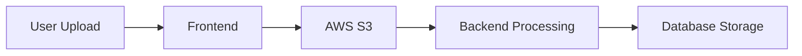
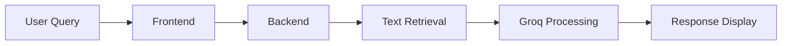

<div align="center">

# 🔍 PDFinsights

A powerful web-based platform for intelligent PDF analysis and querying using AI

[Live Demo](https://pdfinsights.netlify.app/) 

[](https://fastapi.tiangolo.com)
[](https://reactjs.org/)
[](https://tailwindcss.com/)
[](https://www.postgresql.org)
[](https://aws.amazon.com/s3/)
[](https://groq.com)

</div>

> ⚠️ **Important Notice**: If you encounter file upload errors, this might be due to Render's free tier spinning down inactive services. Please try uploading again after a few moments. For production deployments, I recommend using AWS EC2 to avoid such issues and ensure consistent uptime.
>
> 💡 **Quick Fix**: Simply wait a moment and try your upload again. The service should respond on the second attempt.
>
> 🚀 **For Production**: Consider deploying on AWS EC2 for:
> - Consistent uptime
> - Better performance
> - No spin-down issues
> - Reliable file processing

## 📋 Overview

PDFinsites revolutionizes document analysis by combining powerful PDF processing with state-of-the-art AI technology. After a simple login with your name, you can upload PDFs and interact with their content through natural language queries or generate summaries of different lengths, all powered by Groq's advanced language models.

## 🎯 How It Works

1. **Simple Login**: Enter your name to get started
2. **Upload**: Select and upload your PDF file (max 10MB) using the header upload button
3. **Summarize**: Choose from three summary options:
   - Short Summary: Concise overview
   - Medium Summary: Balanced detail
   - Long Summary: Comprehensive analysis
4. **Query**: Use the input box to ask specific questions about your document
5. **Interact**: Click the summary buttons again or use the send button to generate responses

## ✨ Key Features

- 👤 **Simple Access**: Just enter your name to get started
- 📤 **Quick Upload**: Direct PDF upload from the header (up to 10MB)
- 📝 **Flexible Summarization**: Choose from three summary lengths
- 🤖 **AI-Powered Querying**: Context-aware answers using Groq's LLM API
- 🚀 **Fast Processing**: Quick response times for both summaries and queries
- 📱 **Responsive Design**: Works seamlessly on both desktop and mobile
- 🔄 **Interactive Interface**: Simple button-based summary generation

## 🛠️ Technology Stack

### Frontend Infrastructure
- 🎨 **React.js**: Modern UI framework
- 💅 **Tailwind CSS**: Utility-first CSS framework
- 📱 **Responsive Design**: Mobile-first approach
- 🔄 **State Management**: React Context API

### Backend Infrastructure
- 🚀 **FastAPI**: High-performance web framework
- 🐘 **PostgreSQL**: Robust data storage (Hosted on Render)
- ☁️ **AWS S3**: Scalable file storage solution
- 🧠 **Groq API**: Advanced LLM integration (Llama3-70b-8192 model)

### Processing Engines
- 📄 **Fitz (PyMuPDF)**: PDF parsing
- 👁️ **Tesseract**: OCR processing via pdf2image and pytesseract

### Deployment
- 🌐 **Frontend**: Netlify
- 🖥️ **Backend**: Render
- 🗄️ **Database**: PostgreSQL on Render

## 🚀 Getting Started

### Prerequisites
- Python 3.8+
- Node.js
- AWS Account
- Groq API Access

### Installation

1. **Clone the Repository**
```bash
git clone https://github.com/yourusername/pdfinsites.git
cd pdfinsites
```

2. **Install Dependencies**
```bash
# Backend
pip install -r requirements.txt

# Frontend
npm install
```

3. **Configure Environment Variables**

#### Backend Configuration
```env
AWS_ACCESS_KEY_ID=your_key
AWS_SECRET_ACCESS_KEY=your_secret
AWS_REGION=your_region
AWS_BUCKET_NAME=your_bucket
GROQ_API_KEY=your_groq_key
DATABASE_URL=your_db_url
```

#### Frontend Configuration
```env
REACT_APP_AWS_ACCESS_KEY_ID=your_key
REACT_APP_AWS_SECRET_ACCESS_KEY=your_secret
REACT_APP_AWS_REGION=your_region
REACT_APP_AWS_BUCKET_NAME=your_bucket
REACT_APP_CHATBOX=endpoint_url
REACT_APP_UPLOAD=upload_url
```

## 📈 Performance Metrics

- Maximum file size: 10MB
- Average upload time: < 3 seconds
- Summary generation time: < 5 seconds
- Query response time: < 3 seconds
- Supported format: PDF files

## 🔄 System Flow

### PDF Processing Flow


### Query Flow


## 🔌 API Endpoints

### Upload PDF
```http
POST /upload_pdf
Content-Type: application/json

{
    "user_id": "string",
    "filename": "string"
}
```

### Query PDF
```http
POST /query_pdf
Content-Type: application/json

{
    "user_id": "string",
    "question": "string"
}
```

## 🔒 Security Considerations

- 🔐 **Environment Variables**: Secure storage of sensitive credentials
- 🌐 **CORS Protection**: Configured access control for production
- 📂 **S3 Security**: Implement strict IAM policies
- 🔑 **API Authentication**: Secured endpoint access
- 🛡️ **Rate Limiting**: Implemented to prevent abuse
- 🔒 **Data Encryption**: All data encrypted at rest and in transit

## 💡 OCR Implementation

To enable OCR capabilities (AWS deployment only), update the text extraction code:

```python
# Current Implementation
with fitz.open(stream=file_content, filetype="pdf") as doc:
    for page in doc:
        text += page.get_text()

# OCR Implementation
images = convert_from_bytes(file_content)
for image in images:
    text += image_to_string(image, lang="eng")
```

## 🐛 Troubleshooting

Common issues and their solutions:

1. **PDF Upload Fails**
   - Check if file size is under 10MB
   - Verify AWS credentials
   - Try uploading again (Render free tier may need to spin up)
   - Ensure proper permissions

2. **OCR Not Working**
   - Verify Tesseract installation
   - Check image quality
   - Confirm language pack installation

3. **Summary Generation Issues**
   - Try clicking the button again
   - Check if file was uploaded successfully
   - Verify internet connection
---

<div align="center">

[Website](https://pdfinsights.netlify.app/) · [Report Bug](https://github.com/AvaneeshGodra/PDFinsights/issues)
</div>
